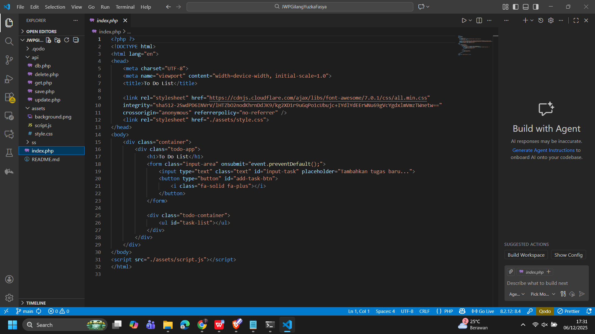
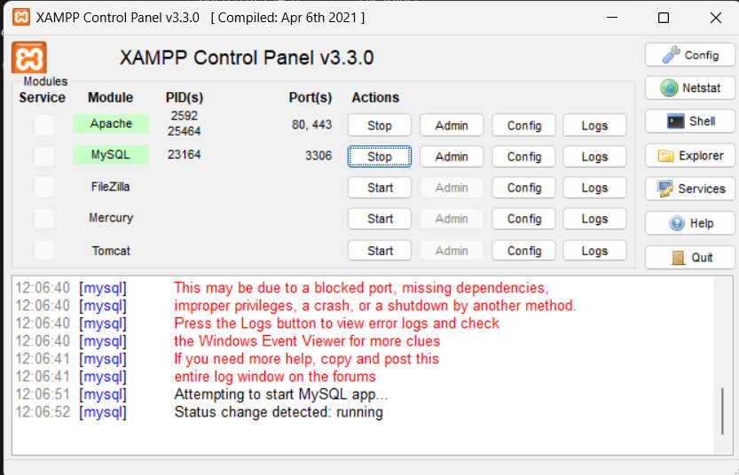
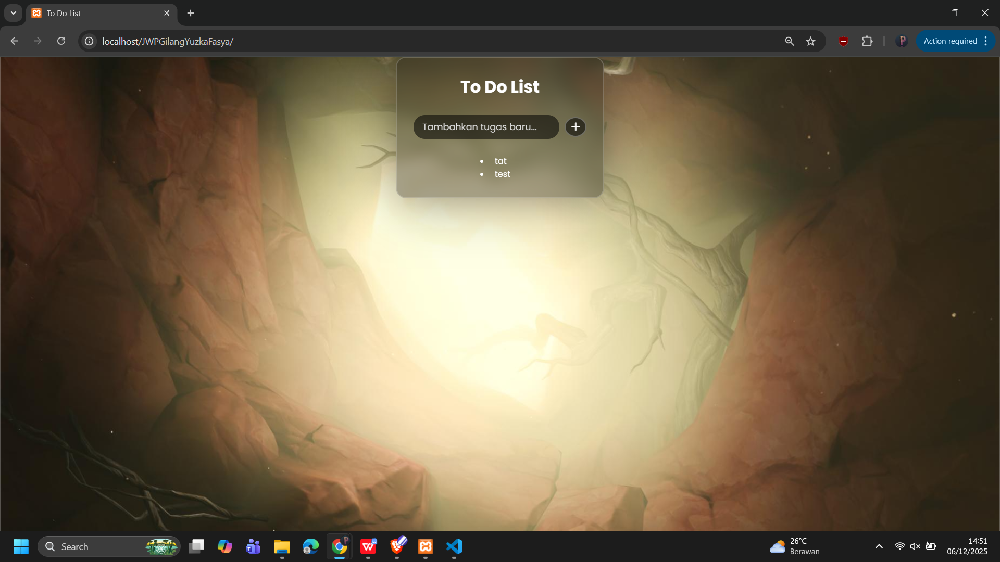
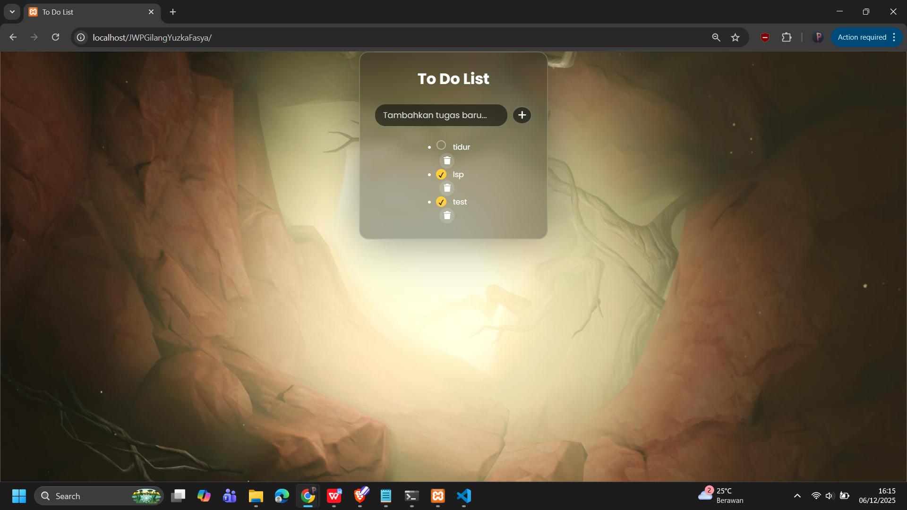
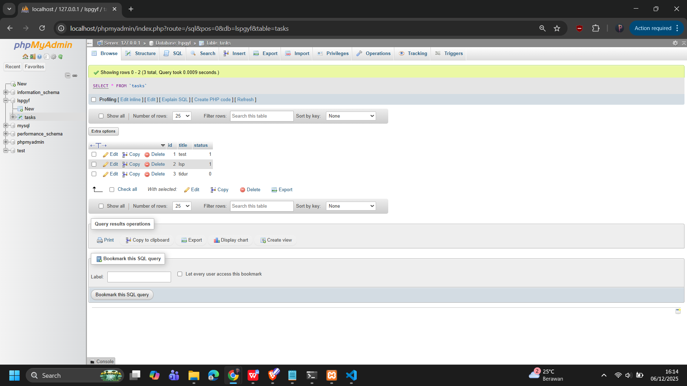

# Aplikasi To-Do-List

## Deskripsi
Aplikasi sederhana berbabsi PHP untuk mencatat tugas harian.

## Fitur
- Tambah tugas
- Tandai tugas selsesai
- Hapus tugas

## Struktur Folder
- 'index.php' - halaman utama
- 'assets/' - file CSS, JS, dan Background

## Cara Menjalankan
1. Salin folder ke 'htdocs/'
2. Jalankan XAMPP dan buka di 'http://localhost/[nama_folder]'

## Kontributor
- [Gilang Yuzka Fasya] (https://github.com/FrostDusk) 

## Kelompok Pekerjaan 1

## Kelompok Pekerjaan 2

## Kelompok Pekerjaan 3

